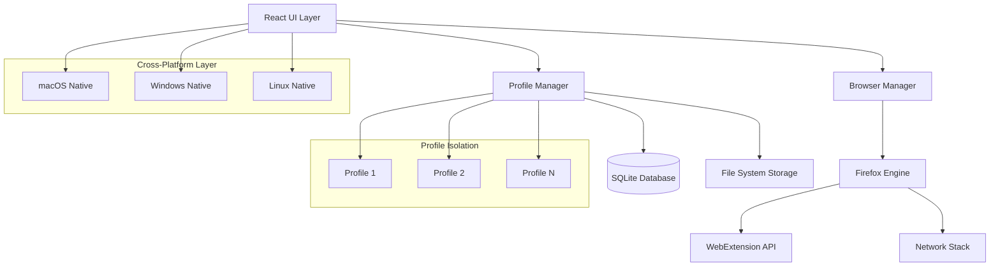

# Ruthenium Browser - Design Document

## Overview

Ruthenium è un browser basato su Firefox che estende le capacità native con un sistema avanzato di gestione profili. L'architettura si basa su Firefox ESR (Extended Support Release) come foundation, implementando un layer di astrazione per la gestione dei profili e un'interfaccia utente completamente ridisegnata.

### Tecnologie Principali
- **Base**: Firefox ESR con modifiche al core
- **UI Framework**: React + Electron per l'interfaccia principale
- **Backend**: Rust per performance critiche + Node.js per logica business
- **Database**: SQLite per dati profili + IndexedDB per cache
- **Cross-platform**: Electron con bindings nativi per ogni OS

## Architecture

### High-Level Architecture



### Core Components

1. **Profile Manager**: Gestisce creazione, isolamento e lifecycle dei profili
2. **Browser Engine**: Firefox engine modificato con API custom per multi-profiling
3. **UI Layer**: Interfaccia React moderna con sidebar profili
4. **Data Isolation Layer**: Sistema di sandboxing per dati profili
5. **Extension Bridge**: Ponte per compatibilità estensioni Firefox
6. **Sync Service**: Servizio per importazione/sincronizzazione Firefox

## Components and Interfaces

### Profile Manager Component

```typescript
interface ProfileManager {
  createProfile(name: string, icon: string): Promise<Profile>
  deleteProfile(profileId: string): Promise<void>
  switchProfile(profileId: string): Promise<void>
  getActiveProfile(): Profile
  getAllProfiles(): Profile[]
  isolateProfileData(profileId: string): Promise<void>
}

interface Profile {
  id: string
  name: string
  icon: string
  createdAt: Date
  lastUsed: Date
  dataPath: string
  settings: ProfileSettings
  tabs: Tab[]
}

interface ProfileSettings {
  userAgent?: string
  antiFingerprinting: boolean
  performanceMode: 'standard' | 'extreme'
  memoryLimit?: number
  autoRotateUserAgent: boolean
}
```

### Browser Engine Interface

```typescript
interface BrowserEngine {
  initializeProfile(profile: Profile): Promise<void>
  createTab(profileId: string, url?: string): Promise<Tab>
  closeTab(tabId: string): Promise<void>
  navigateTab(tabId: string, url: string): Promise<void>
  getProfileTabs(profileId: string): Tab[]
  applyUserAgent(profileId: string, userAgent: string): Promise<void>
}

interface Tab {
  id: string
  profileId: string
  url: string
  title: string
  favicon?: string
  isActive: boolean
  isLoading: boolean
}
```

### UI Components Architecture

```typescript
// Main App Structure
const App = () => (
  <div className="browser-container">
    <ProfileSidebar />
    <MainBrowserArea />
    <StatusBar />
  </div>
)

// Profile Sidebar Component
interface ProfileSidebarProps {
  profiles: Profile[]
  activeProfile: Profile
  onProfileSwitch: (profileId: string) => void
  onProfileCreate: () => void
  onProfileDelete: (profileId: string) => void
}

// Main Browser Area
interface MainBrowserAreaProps {
  activeProfile: Profile
  tabs: Tab[]
  onTabCreate: () => void
  onTabClose: (tabId: string) => void
  onTabSwitch: (tabId: string) => void
}
```

## Data Models

### Database Schema

```sql
-- Profiles table
CREATE TABLE profiles (
  id TEXT PRIMARY KEY,
  name TEXT NOT NULL,
  icon TEXT,
  created_at DATETIME DEFAULT CURRENT_TIMESTAMP,
  last_used DATETIME,
  data_path TEXT NOT NULL,
  settings JSON
);

-- Profile sessions (for crash recovery)
CREATE TABLE profile_sessions (
  id TEXT PRIMARY KEY,
  profile_id TEXT REFERENCES profiles(id),
  tabs JSON,
  window_state JSON,
  created_at DATETIME DEFAULT CURRENT_TIMESTAMP
);

-- User agent presets
CREATE TABLE user_agent_presets (
  id TEXT PRIMARY KEY,
  name TEXT NOT NULL,
  user_agent TEXT NOT NULL,
  description TEXT
);

-- Performance metrics
CREATE TABLE performance_metrics (
  id TEXT PRIMARY KEY,
  profile_id TEXT REFERENCES profiles(id),
  memory_usage INTEGER,
  cpu_usage REAL,
  timestamp DATETIME DEFAULT CURRENT_TIMESTAMP
);
```

### File System Structure

```
~/.ruthenium-browser/
├── profiles/
│   ├── profile-1/
│   │   ├── cookies.sqlite
│   │   ├── places.sqlite (history/bookmarks)
│   │   ├── permissions.sqlite
│   │   ├── extensions/
│   │   └── cache/
│   └── profile-2/
│       └── ...
├── config/
│   ├── app-settings.json
│   └── user-agent-presets.json
└── logs/
    └── app.log
```

## Error Handling

### Error Categories

1. **Profile Errors**
   - Profile creation failures
   - Data corruption
   - Insufficient disk space
   - Permission issues

2. **Browser Engine Errors**
   - Tab crashes
   - Navigation failures
   - Extension conflicts
   - Memory exhaustion

3. **Sync Errors**
   - Firefox import failures
   - Network connectivity issues
   - Authentication failures

### Error Recovery Strategies

```typescript
interface ErrorHandler {
  handleProfileError(error: ProfileError): Promise<void>
  handleBrowserError(error: BrowserError): Promise<void>
  recoverFromCrash(profileId: string): Promise<void>
  showUserFriendlyError(error: Error): void
}

// Example error recovery
class ProfileErrorHandler implements ErrorHandler {
  async handleProfileError(error: ProfileError): Promise<void> {
    switch (error.type) {
      case 'CORRUPTION':
        await this.backupAndRecreateProfile(error.profileId)
        break
      case 'DISK_SPACE':
        await this.showDiskSpaceWarning()
        break
      case 'PERMISSIONS':
        await this.requestPermissions()
        break
    }
  }
}
```

## Testing Strategy

### Unit Testing
- **Profile Manager**: Test creazione, eliminazione, switch profili
- **Data Isolation**: Verificare separazione completa dati
- **User Agent Spoofing**: Test applicazione corretta user agent
- **Import/Export**: Test migrazione dati Firefox

### Integration Testing
- **Multi-Profile Navigation**: Test navigazione simultanea
- **Extension Compatibility**: Test estensioni Firefox
- **Cross-Platform**: Test su macOS, Windows, Linux
- **Performance**: Test con molti profili attivi

### End-to-End Testing
- **User Workflows**: Test scenari utente completi
- **Crash Recovery**: Test ripristino dopo crash
- **Data Persistence**: Test salvataggio dati tra sessioni
- **UI Responsiveness**: Test interfaccia sotto carico

### Performance Testing
```typescript
interface PerformanceMetrics {
  profileSwitchTime: number // < 500ms requirement
  memoryUsagePerProfile: number
  cpuUsageUnderLoad: number
  startupTime: number
}

// Performance benchmarks
const PERFORMANCE_TARGETS = {
  profileSwitchTime: 500, // ms
  maxMemoryPerProfile: 512, // MB
  maxCpuUsage: 30, // %
  maxStartupTime: 3000 // ms
}
```

## Security Considerations

### Profile Isolation
- Separate process per profilo per isolamento completo
- Sandboxing filesystem per prevenire accesso cross-profile
- Isolamento network stack per prevenire cookie leakage
- Crittografia dati sensibili (password, sessioni)

### Privacy Features
- User agent rotation automatica
- Anti-fingerprinting avanzato
- DNS over HTTPS per default
- Blocco tracker integrato per profilo

### Extension Security
- Validazione estensioni prima installazione
- Isolamento permessi estensioni per profilo
- Monitoring attività estensioni sospette
- Whitelist estensioni verificate

## Platform-Specific Implementation

### macOS
```typescript
interface MacOSIntegration {
  setupNativeMenus(): void
  handleAppleEvents(): void
  integrateWithSpotlight(): void
  setupNotificationCenter(): void
}
```

### Windows
```typescript
interface WindowsIntegration {
  setupTaskbarIntegration(): void
  handleWindowsNotifications(): void
  integrateWithStartMenu(): void
  setupJumpLists(): void
}
```

### Linux
```typescript
interface LinuxIntegration {
  setupDesktopEntry(): void
  handleDBusIntegration(): void
  integrateWithSystemTray(): void
  setupMimeTypes(): void
}
```

## UI/UX Design Specifications

### Design System
- **Color Palette**: Modern dark/light themes con accent colors personalizzabili
- **Typography**: System fonts per ogni piattaforma (SF Pro, Segoe UI, Ubuntu)
- **Spacing**: Grid system 8px per consistenza
- **Animations**: 200-300ms transitions, easing curves naturali

### Component Library
```typescript
// Design tokens
const DESIGN_TOKENS = {
  colors: {
    primary: '#0078d4',
    secondary: '#6b73ff',
    success: '#107c10',
    warning: '#ff8c00',
    error: '#d13438'
  },
  spacing: {
    xs: '4px',
    sm: '8px',
    md: '16px',
    lg: '24px',
    xl: '32px'
  },
  borderRadius: {
    sm: '4px',
    md: '8px',
    lg: '12px'
  }
}
```

### Responsive Design
- Sidebar collassabile per schermi piccoli
- Tab overflow con scroll orizzontale
- Adaptive layout per diverse risoluzioni
- Touch-friendly su dispositivi touchscreen